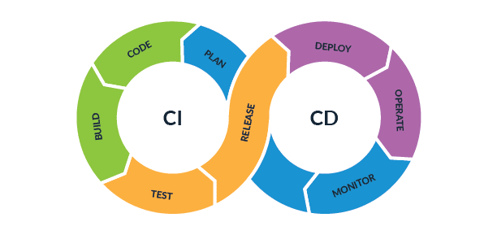

## مقدمه
فرض کنید به عنوان یک توسعه‌دهنده نرم‌افزار ساعت‌ها از وقت خود را برای توسعه یک نیازمندی مطرح شده و اضافه کردن آن فیچر به پروژه خود صرف کرده‌اید؛ کد توسعه داده شده توسط شما به درستی کار می‌کند، تست‌های نوشته شده پاس می‌شوند و همه چیز در شرایط مطلوب قرار دارد. به عنوان آخرین اقدام کاری امروز می‌خواهید برنچ توسعه جدید را
Push
کرده و در نهایت با
Merge
کردن به روز کاری خود پایان دهید. در چنین شرایطی احتمالا خطای
Merge Conflict
از سمت
Git
آخرین خطایی باشد که دوست داشته باشید ببینید چون برای حل آن و تمام کردن کار خود، باید تفاوت‌های موجود میان کد خودتان و آخرین نسخه کد روی برنچ مقصد را بررسی کنید، قسمت‌های درست را انتخاب کنید، تست‌ها را دوباره اجرا بگیرید و بعد از مطمئن شدن از پاس شدن تمام تست‌ها دوباره برای
Merge
کردن تلاش کنید.  
رخ دادن چنین خطاها و مشکلاتی در پروژه‌های کوچک و درصورتی که به ندرت اتفاق بیفتند مشکل خاصی ایجاد نمی‌کند. اما تصور کنید یک تیم توسعه که با سرعت زیاد به اضافه‌کردن ویژگی‌های جدید و  تغییر کدهای قدیمی مشغول هستند 
(که به اقتضای سرعت زیاد نرخ رخ دادن این مشکلات هم بیشتر می‌شود)
 چه هزینه‌های مالی و زمانی زیادی را ممکن است از این بابت متحمل شوند.  

رویکرد
CI/CD
برای حل کردن چنین مشکلاتی و بالا بردن بهروی و سرعت در توسعه‌نرم افزار پدید آمد. در ادامه به بررسی دقیق‌تر این مفهوم می‌پردازیم.  

## CI/CD چیست؟
در عبارت
CI/CD
بخش
CI
به
Continous Integration
اشاره دارد و بخش
CD
به
Continous Delivery
که هدف آن اتوماتیک کردن و سرعت بخشیدن به فعالیت‌ها و کارهایی است که در گذشته به صورت دستی انجام می‌شد تا یک تکه کد از ادیتور توسعه‌دهنده به مرحله استقرار در محصول قابل استفاده توسط مشتری برسد. این مراحل می‌توانند شامل
بیلد، تست و استقرار باشند. استفاده کردن از این مفاهیم به وسیله طراحی و استفاده از پایپلاین‌های
CI/CD
ممکن می‌شود.
به عنوان یک فرد فعال در حوزه توسعه نرم‌افزار و به خصوص فردی که در حوزه دواپس فعالیت دارد انتظار می‌رود با این مفاهیم آشنا باشیم و به خوبی آن‌ها را درک کنیم.

:::info نکته
در برخی از منابع
CD
به بحث
Continous Deployment
هم اشاره دارد که در ادامه توضیح داده شده است.
:::

## CI (Continous Integration)
همانطور که گفته شد
CI
مخفف
Continous Integration
است.
CI
به موضوع انتقال کدهای جدید به
Code Base
مشترک پروژه، اجرای تست‌ها و بیلد گرفتن به صورت اتوماتیک و تحت شرایط مشخص اشاره دارد. برای مثال شما می‌توانید فرایند
CI
خود را به گونه‌ای تنظیم کنید که با ایجاد هر
pull request
روی برنچ اصلی ریپازیتوری، یک بار تست‌های برنچ پوش شده اجرا شوند، از آن بیلد گرفته شود و در صورت عدم بروز هرگونه مشکلی، امکان مرج برای توسعه‌دهنده آن برنچ فراهم شود. با استفاده از این مفهوم، مشکلات امنیتی و ارورهای موجود در کد بسیار زودتر از آن که بتوانند اختلالی در پروژه و کار تیم ایجاد کنند شناسایی و آماده رفع شدن می‌شوند. تحت این شرایط حتی اگر چندین توسعه‌دهنده مشغول کار روی یک قسمت از پروژه باشند؛ مشکلات و مسائلی مانند
merge conflict
به حداقل می‌رسند و سرعت توسعه و بازدهی تیم بسیار بهبود می‌یابد.

## CD (Continous Delivery)
Continous Delivery
مفهومی است که به صورت پیوسته با مفهوم قبلی یعنی
CI
کار می‌کند. پس از اینکه کد توسط مراحل مختلفی که در
CI
وجود دارند تست و بیلد شد
CD،
کار خود را آغاز می‌کند و پروژه را با تمام نیازمندی‌ها و وابستگی‌هایش به صورت یک پکیج واحد در می‌آورد تا بتوان در هر زمانی و در هر محیطی فرایند استقرار آن را به راحتی شروع کرد. استقرار می‌تواند به صورت دستی و یا با استفاده از مفهوم
Continous Deployment
صورت گیرد.  

## Continous Deployment
Continous Deployment
تیم‌ها و سازمان‌های مختلف را قادر می‌سازد تا فرایند استقرار محصولات خود را به صورت کاملا اتوماتیک و بدون نیاز به دخالت انسانی، به روشی که در گذشته صورت می‌گرفت، انجام دهند. با استفاده از این مفهوم می‌توان فرایند رسیدن فیچرها و نیازمندی‌های جدید پیاده‌سازی شده را بهتر مدیریت کرد و آن‌ها را در بهترین حالت و در کمترین زمان ممکن به دست کاربران رساند.

:::info نکته
شما می‌توانید در سیستم خود
Continous Integration
را بدون داشتن
Continous Delivery
یا
Continous Deployment
داشته باشید؛ اما داشتن
CD
بدون داشتن
CI
بسیار مشکل و عملا غیرممکن است چون شما برای رسیدن به اهداف
CD
به قابلیت‌هایی که رعایت اصول
CI
برای شما فراهم می‌کند مانند ادغام کدهای توسعه داده شده با برنچ اصلی ریپازیتوری و همچنین فرایندهای بیلد و تست اتوماتیک نیاز دارید.
:::

## فواید CI/CD

* تحویل سریع‌تر و بهینه‌تر نرم‌افزار از فاز توسعه به فاز استقرار.
* افزایش بهره‌وری تیم با اتوماتیک کردن فرایندهایی که نیاز به صرف زمان داشتند.
* تست کردن تمام تغییرات اعمال شده باعث کاهش ریسک‌های موجود در تحویل یک نیازمندی می‌شود.
* استاندارد و یک پارچه کردن فرایندهای توسعه نرم‌افزار با مشخص کردن گام‌هایی مانند بیلد و تست که با هر تغییر اجرا می‌شوند.

## پایپلاین CI/CD
برای اعمال مفاهیم و اصول
CI/CD
از پایپلاین‌های
CI/CD
استفاده می‌کنیم. این پایپلاین‌ها با استفاده از ابزارهای مختلف قابل پیاده‌سازی و استفاده هستند و به ما امکان تعریف کردن فازهای مختلف چرخه حیات یک نرم‌افزار را می‌دهند. با این روش ما می‌توانیم پایپلاین‌های دلخواه خود را بر حسب نیازهای تیم طراحی کرده و از آن‌ها جهت افزایش بهره‌وری و راندمان سازمان استفاده کنیم.  

تعدادی از بهترین ابزارهای
CI/CD
در ادامه معرفی شده‌اند. برای آشنایی بیشتر با هرکدام می‌توانید روی نام آن‌ها کلیک کرده تا وارد سایت مربوطه شوید.  

* [Terraform](https://www.terraform.io)
* [Azure Devops](https://azure.microsoft.com/en-us/products/devops)
* [Jenkins](https://www.jenkins.io)
* [GitLab](https://about.gitlab.com)
* [GitHub Actions](https://github.com/features/actions)